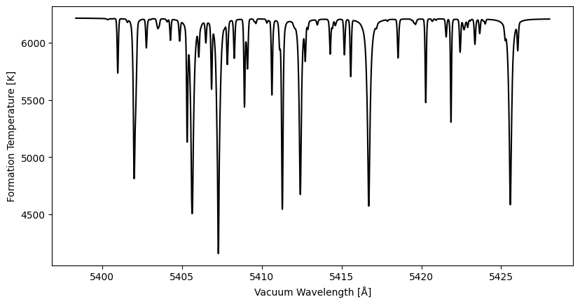

# FormationTemps.jl
[](https://michaelpalumbo.me/FormationTemps.jl/dev/)
[](https://github.com/palumbom/FormationTemps.jl/actions/workflows/CI.yml?query=branch%3Amain)
[](https://arxiv.org/abs/2512.09861)

FormationTemperatures.jl wraps [Korg.jl](https://github.com/ajwheeler/Korg.jl) to produce model spectra and formation temperatures given fundamental stellar parameters and a linelist as input.

## Installation

FormationTemperatures.jl is written entirely in Julia and requires Julia v1.12 or greater. Installation instructions for Julia are available from [julialang.org](https://julialang.org/downloads/).

To install FormationTemps.jl:

```bash
git clone git@github.com:palumbom/FormationTemps.jl.git
cd FormationTemps.jl
julia
```

Then from the Julia REPL:

```julia
using Pkg
Pkg.add(path=".")
using FormationTemps
```

### Basic Julia Example

To compute a basic formation temperature spectrum:

```julia
using Korg
using PyPlot
using FormationTemps; FT = FormationTemps

# get the linelist
linelist = Korg.read_linelist(joinpath(FT.datdir, "Sun_VALD.lin"))[16000:16100]

# set stellar parameters
Teff = 5777.0
logg = 4.44
A_X = Korg.asplund_2020_solar_abundances
Fe_H = 0.0
vsini = 2100.0
ζ_RT = 3400.0   # radial-tangential macroturbulent broadening 
ξ = 850.0       # microturbulent broadenign

# create StellarProps composite type to hold everything 
star_props = StellarProps(Teff=Teff, logg=logg, Fe_H=Fe_H, 
                          vsini=vsini, v_macro=ζ_RT, v_micro=ξ)

# get the flux + formation temperature spectra
form_temp_result = FT.calc_formation_temp(star_props, linelist; Δλ=0.01)

# parse the result
wavs = form_temp_result.wavs
flux = form_temp_result.flux
temp = form_temp_result.form_temps

# plot the result
fig, ax1 = plt.subplots()
ax1.plot(wavs, temp, c="k")
ax1.set_xlabel("Vacuum Wavelength [Å]")
ax1.set_ylabel("Formation Temperature [K]")
plt.show()
```


More detail on the above example can be found in the [Basic Tutorial](https://michaelpalumbo.me/FormationTemps.jl/dev/tutorial/) and the [high-level API documentation]().

### Calling FormationTemps.jl from Python

> [!WARNING] 
> Calling FormationTemps.jl from Python is currently somewhat fragile and a work in progress. 

FormationTemps.jl can be called from Python. The instructions can be found in the [Python Tutorial](https://michaelpalumbo.me/FormationTemps.jl/dev/pycall/). 

## Caveats

Users should be aware of the technical and "philosophical" comments discussed in Sections 4.2 and 4.3 of [the paper](https://arxiv.org/abs/2512.09861) presenting FormationTemps.jl. In brief:

* Formation temperature spectra are *modeled* and not measured
* The definition/concept of a formation temperature can belie some realities of radiative transfer
* Korg.jl only assumes LTE, and the MARCS model atmospheres used by default do not have chromospheres
* The model atmospheres are 1D, and do not handle the effects of convection (limb shift, line asymmetry, etc.)

## Citation
[](https://arxiv.org/abs/2512.09861)

If you use FormationTemps.jl in your research, please cite the relevant [software release]() and [paper](https://ui.adsabs.harvard.edu/abs/2025arXiv251209861P/abstract).

## Author & Contact 
[](https://github.com/palumbom)

This repo is maintained by [Michael Palumbo](https://michaelpalumbo.me). You may may contact him via his email - [mpalumbo@flatironinstitute.org](mailto:mpalumbo@flatironinstitute.org)