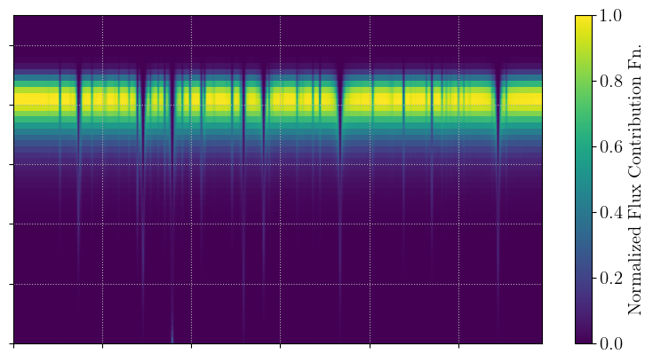
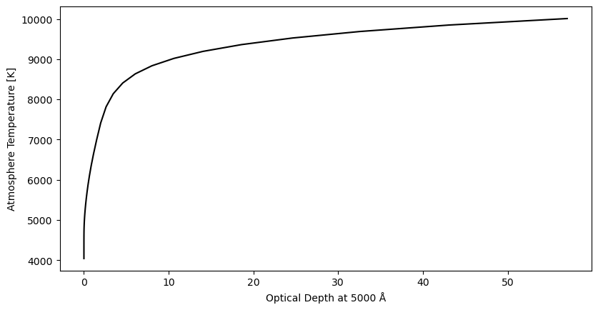
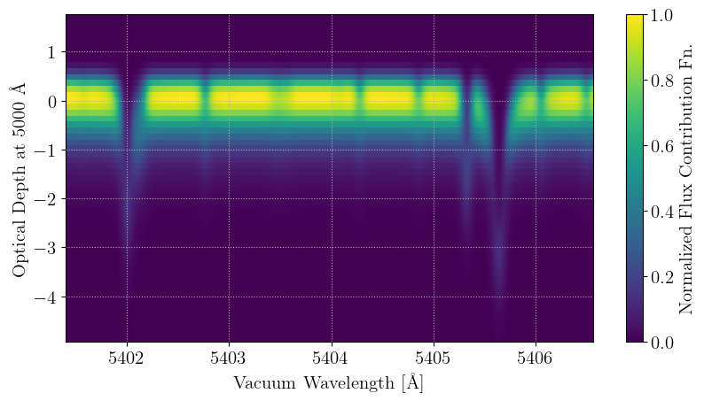
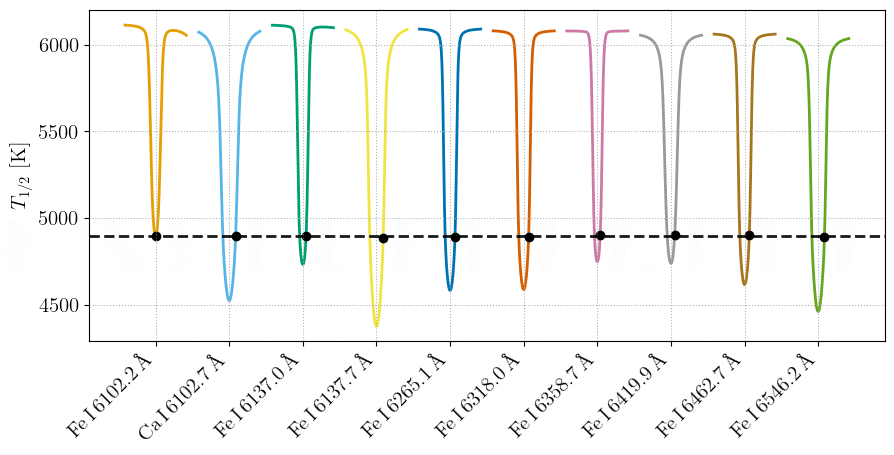
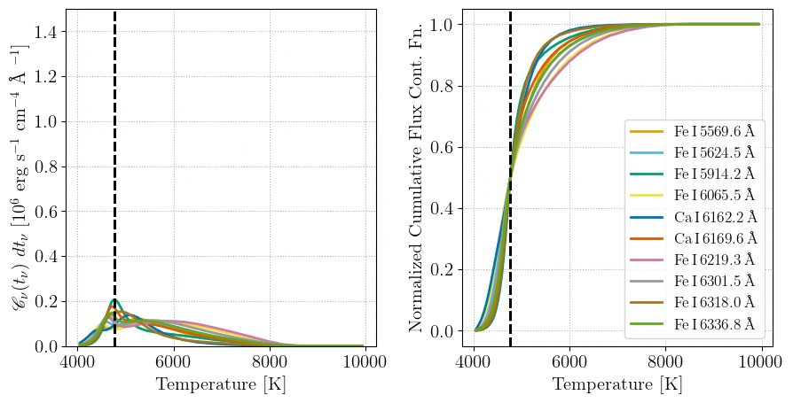

# Manipulating Contribution Functions

Formation temperatures are computed from the model contribution functions, and can be thought of as a simple summary statistic thereof. For some users, it may be advantageous to view and manipulate these contribution functions. 

Following a procedure like that in the [Basic Tutorial](@ref "Basic Tutorial"), we can see that the ```FormTempResult``` composite type also contains a ```cont_func``` field. We can plot this like so:

```@eval
using Markdown
code = read(joinpath(pwd(), "examples", "cont_func.jl"), String)
break_marker = "# BREAK1"
stop_idx = findfirst(break_marker, code)
code = stop_idx === nothing ? code : code[1:prevind(code, stop_idx.start)]
Markdown.parse("```julia\n" * code * "\n```")
```


## Integrals or densities?

`cont_func` holds **per-interval integrals**: element `[k, j]` is the contribution of the
atmosphere interval between layers `k` and `k+1` to the flux at wavelength `j`, so

```julia
sum(result.cont_func, dims=1)   # ∝ the emergent flux
```

Each element therefore already carries the width of its own layer interval. That has a
consequence worth stating plainly, because it points in opposite directions for two different
uses:

- **Sums over depth use `cont_func` directly.** Weighted means, cumulative distributions, and
  the 50% crossing behind [`form_temps_from_cfunc`](@ref) are all sums, in which the interval
  width cancels. These are independent of the model's layer grid. Dividing by the interval
  width first would drop that weighting and bias the result.
- **Comparisons across depth need a density.** Plotting against depth, or taking a ratio of
  one interval to another, reads the interval widths as if they were signal. MARCS samples
  depth at Δlog τ_ref = 0.1 dex for log τ_ref ∈ [-3, +1] and 0.2 dex outside it, so a raw
  plot of `cont_func` carries a factor-of-two step at those two depths that is an artifact of
  the grid, not of the physics. [`cfunc_per_dex`](@ref) divides the width out, giving
  `dF/dlog₁₀τ_ref`.

The examples on this page plot `cfunc_per_dex(result)` for that reason.
[`ceiling_ratio`](@ref) is a ratio of two intervals, so it requires the reference grid for the
same reason and applies the conversion internally.

We can also add axis values. The x-axis is wavelength, and y-axis is a coordinate in the model atmosphere. Let's first parse out and view the model atmosphere structure from the ```FormTempResult``` composite type instance. 

```@eval
using Markdown
code = read(joinpath(pwd(), "examples", "cont_func.jl"), String)
start_marker = "# BREAK1"
end_marker = "# BREAK2"
start_idx = findfirst(start_marker, code)
end_idx = findfirst(end_marker, code)
if start_idx !== nothing && end_idx !== nothing && start_idx.start < end_idx.start
    start_nl = findnext('\n', code, start_idx.start)
    slice_start = start_nl === nothing ? lastindex(code) + 1 : nextind(code, start_nl)
    slice_end = prevind(code, end_idx.start)
    code = slice_start <= slice_end ? code[slice_start:slice_end] : ""
end
Markdown.parse("```julia\n" * code * "\n```")
```


Now we can zoom-in on some lines (to better see the structure of the contribution function) and add on the axis values:
```@eval
using Markdown
code = read(joinpath(pwd(), "examples", "cont_func.jl"), String)
start_marker = "# BREAK2"
end_marker = "# BREAK3"
start_idx = findfirst(start_marker, code)
end_idx = findfirst(end_marker, code)
if start_idx !== nothing && end_idx !== nothing && start_idx.start < end_idx.start
    start_nl = findnext('\n', code, start_idx.start)
    slice_start = start_nl === nothing ? lastindex(code) + 1 : nextind(code, start_nl)
    slice_end = prevind(code, end_idx.start)
    code = slice_start <= slice_end ? code[slice_start:slice_end] : ""
end
Markdown.parse("```julia\n" * code * "\n```")
```


## Formation temperatures can lie to you!

We can also slice through the contribution functions of individual pixels in lines. Doing so, we can demonstrate that wavelength elements which share a formation temperature need not have the same (or even similar) contribution functions! In each frame of the below animations, the contribution functions for the black pixel in each absorption line are shown. These pixels share the same formation temperature (within a tolerance of a couple Kelvin), yet their contribution functions look very different in the cores of the lines! Of course, the contribution functions tend to each other toward the continuum, but the bulk of the radial velocity information is found where the derivative of the spectrum is highest. 


