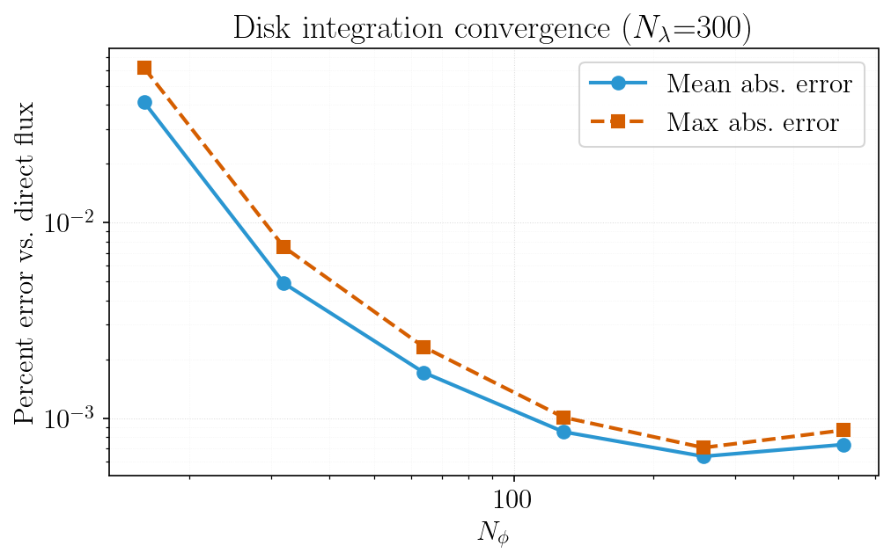
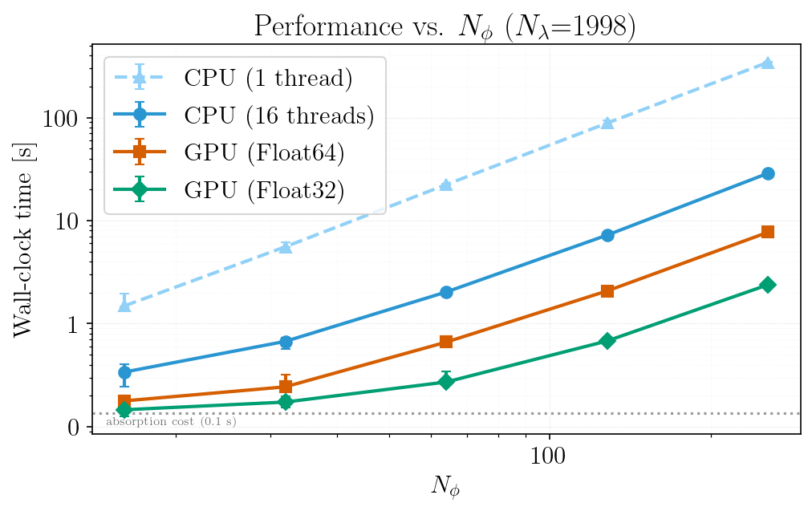

# Broadening & Convolutions

```@meta
CurrentModule = FormationTemps
```

FormationTemps.jl exposes the broadening kernels and convolution routines it uses internally so they can be applied directly to any spectrum. This page demonstrates each option and compares the convolution approximation to full disk integration.

See the [Public Functions](@ref "Public Functions") page for full API documentation on each function.

## Disk integration vs. convolution approximation

By default `calc_formation_temp` performs a numerical disk integration over the stellar surface (`method=:disk`). Passing `method=:hirano` (equivalently the legacy `convolve=true`) instead applies the Hirano et al. (2011) combined rotation + macroturbulence kernel in the Fourier domain. This is much faster, but ultimately an approximation. A third option, `method=:quadrature`, recovers most of the disk-integration accuracy at a fraction of the cost — see [Integration Methods](@ref) for the full comparison. The code below shows the disk-integration and Hirano modes and their difference:

```@eval
using Markdown
code = read(joinpath(pwd(), "examples", "convolutions.jl"), String)
start_marker = "# BREAK1"
end_marker = "# BREAK2"
start_idx = findfirst(start_marker, code)
end_idx = findfirst(end_marker, code)
if start_idx !== nothing && end_idx !== nothing
    start_nl = findnext('\n', code, start_idx.start)
    slice_start = start_nl === nothing ? lastindex(code) + 1 : nextind(code, start_nl)
    slice_end = prevind(code, end_idx.start)
    code = slice_start <= slice_end ? code[slice_start:slice_end] : ""
end
Markdown.parse("```julia\n" * code * "\n```")
```


## Broadening kernels

Three macroturbulence kernels are available. The Gray rotation kernel handles rotational broadening only; the isotropic and anisotropic radial-tangential (RT) kernels handle macroturbulent broadening. The Hirano kernel (used with `method=:hirano`) combines rotation and RT macro in a single Fourier-domain operation.

```@eval
using Markdown
code = read(joinpath(pwd(), "examples", "convolutions.jl"), String)
start_marker = "# BREAK2"
end_marker = "# BREAK3"
start_idx = findfirst(start_marker, code)
end_idx = findfirst(end_marker, code)
if start_idx !== nothing && end_idx !== nothing
    start_nl = findnext('\n', code, start_idx.start)
    slice_start = start_nl === nothing ? lastindex(code) + 1 : nextind(code, start_nl)
    slice_end = prevind(code, end_idx.start)
    code = slice_start <= slice_end ? code[slice_start:slice_end] : ""
end
Markdown.parse("```julia\n" * code * "\n```")
```


## Applying convolutions to a spectrum

Each kernel has a matching `convolve_*` function that accepts a wavelength grid and spectrum vector (or matrix):

```@eval
using Markdown
code = read(joinpath(pwd(), "examples", "convolutions.jl"), String)
start_marker = "# BREAK3"
end_marker = "# BREAK4"
start_idx = findfirst(start_marker, code)
end_idx = findfirst(end_marker, code)
if start_idx !== nothing && end_idx !== nothing
    start_nl = findnext('\n', code, start_idx.start)
    slice_start = start_nl === nothing ? lastindex(code) + 1 : nextind(code, start_nl)
    slice_end = prevind(code, end_idx.start)
    code = slice_start <= slice_end ? code[slice_start:slice_end] : ""
end
Markdown.parse("```julia\n" * code * "\n```")
```


## Disk integration convergence

The numerical disk integration approximates the stellar surface with an ``N_\phi \times 2N_\phi`` grid of tiles. The plot below shows how the integrated flux converges toward the direct (no-integration) reference as the grid resolution increases. Both the mean and maximum absolute percent error across all wavelength bins are shown.



At ``N_\phi = 128`` (the default), the mean error is well below 1% and the maximum error is on the order of a few tenths of a percent. Doubling to ``N_\phi = 256`` or ``512`` reduces the error further but with diminishing returns and quadratically increasing cost, since the number of visible tiles scales as ``\sim N_\phi^2``:



The dotted line marks the cost of the absorption calculation (`compute_alpha!`), which is independent of ``N_\phi``. Below it there is nothing to gain from a coarser surface grid — the calculation is no longer tile-bound. For most applications ``N_\phi = 128`` provides a good balance between accuracy and runtime; if it is too slow, prefer [`method=:quadrature`](@ref "Integration Methods") over coarsening ``N_\phi``, since it reduces the transfer cost rather than the fidelity of the surface grid.
