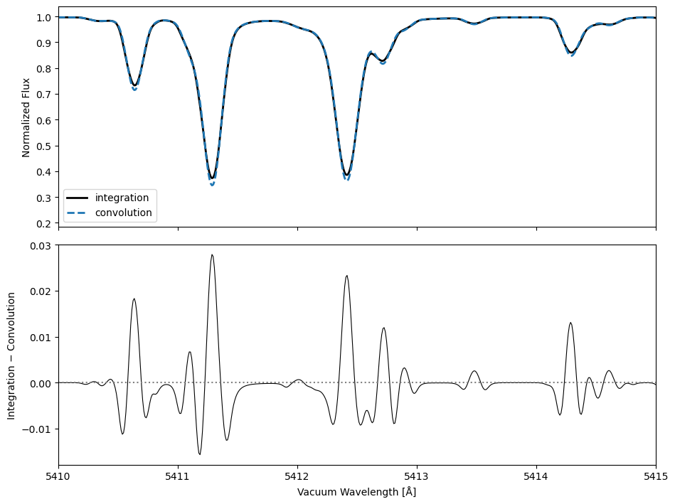
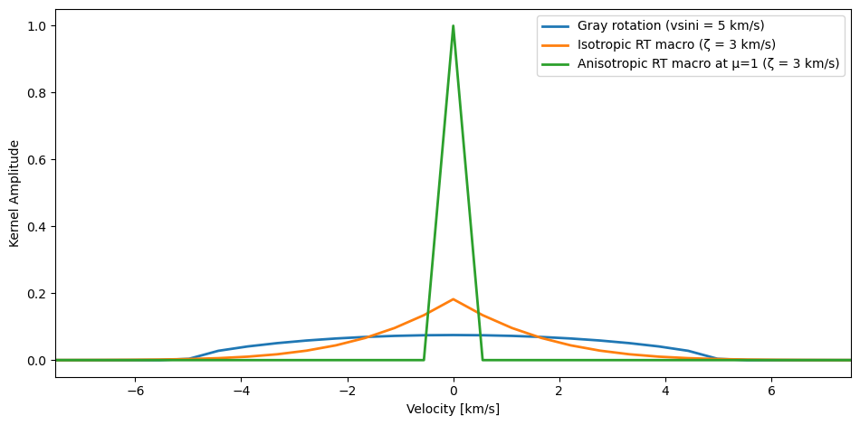
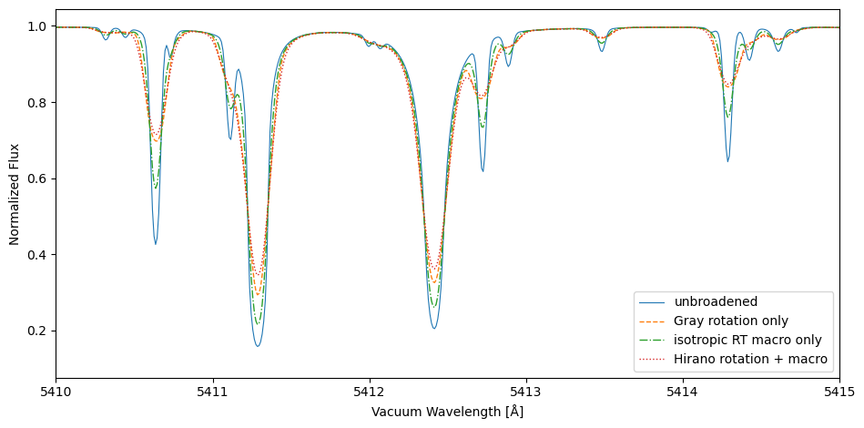

# Broadening & Convolutions

```@meta
CurrentModule = FormationTemps
```

FormationTemps.jl exposes the broadening kernels and convolution routines it uses internally so they can be applied directly to any spectrum. This page demonstrates each option and compares the convolution approximation to full disk integration.

## Disk integration vs. convolution approximation

By default `calc_formation_temp` performs a numerical disk integration over the stellar surface. Passing `convolve=true` instead applies the Hirano et al. (2011) combined rotation + macroturbulence kernel in the Fourier domain. This is much faster, but ultimately an approximation. The code below shows both modes and their difference:

```@eval
using Markdown
code = read(joinpath(pwd(), "examples", "convolutions.jl"), String)
start_marker = "# BREAK1"
end_marker = "# BREAK2"
start_idx = findfirst(start_marker, code)
end_idx = findfirst(end_marker, code)
if start_idx !== nothing && end_idx !== nothing
    start_nl = findnext('\n', code, start_idx.start)
    slice_start = start_nl === nothing ? lastindex(code) + 1 : nextind(code, start_nl)
    slice_end = prevind(code, end_idx.start)
    code = slice_start <= slice_end ? code[slice_start:slice_end] : ""
end
Markdown.parse("```julia\n" * code * "\n```")
```


## Broadening kernels

Three macroturbulence kernels are available. The Gray rotation kernel handles rotational broadening only; the isotropic and anisotropic radial-tangential (RT) kernels handle macroturbulent broadening. The Hirano kernel (used with `convolve=true`) combines rotation and RT macro in a single Fourier-domain operation.

```@eval
using Markdown
code = read(joinpath(pwd(), "examples", "convolutions.jl"), String)
start_marker = "# BREAK2"
end_marker = "# BREAK3"
start_idx = findfirst(start_marker, code)
end_idx = findfirst(end_marker, code)
if start_idx !== nothing && end_idx !== nothing
    start_nl = findnext('\n', code, start_idx.start)
    slice_start = start_nl === nothing ? lastindex(code) + 1 : nextind(code, start_nl)
    slice_end = prevind(code, end_idx.start)
    code = slice_start <= slice_end ? code[slice_start:slice_end] : ""
end
Markdown.parse("```julia\n" * code * "\n```")
```


## Applying convolutions to a spectrum

Each kernel has a matching `convolve_*` function that accepts a wavelength grid and spectrum vector (or matrix):

```@eval
using Markdown
code = read(joinpath(pwd(), "examples", "convolutions.jl"), String)
start_marker = "# BREAK3"
end_marker = "# BREAK4"
start_idx = findfirst(start_marker, code)
end_idx = findfirst(end_marker, code)
if start_idx !== nothing && end_idx !== nothing
    start_nl = findnext('\n', code, start_idx.start)
    slice_start = start_nl === nothing ? lastindex(code) + 1 : nextind(code, start_nl)
    slice_end = prevind(code, end_idx.start)
    code = slice_start <= slice_end ? code[slice_start:slice_end] : ""
end
Markdown.parse("```julia\n" * code * "\n```")
```


See the [Public Functions](@ref "Public Functions") page for full API documentation on each function.
