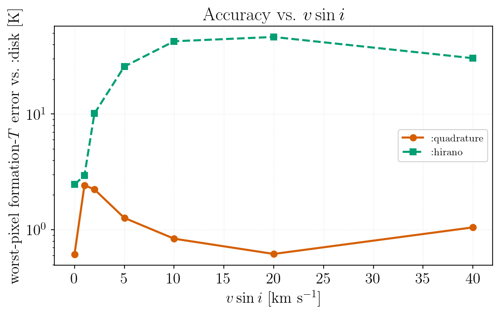
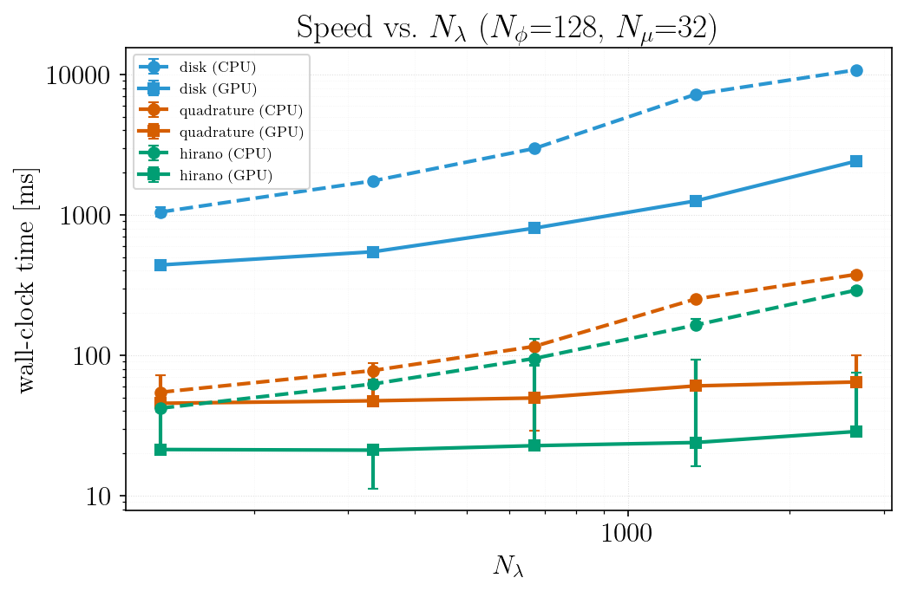
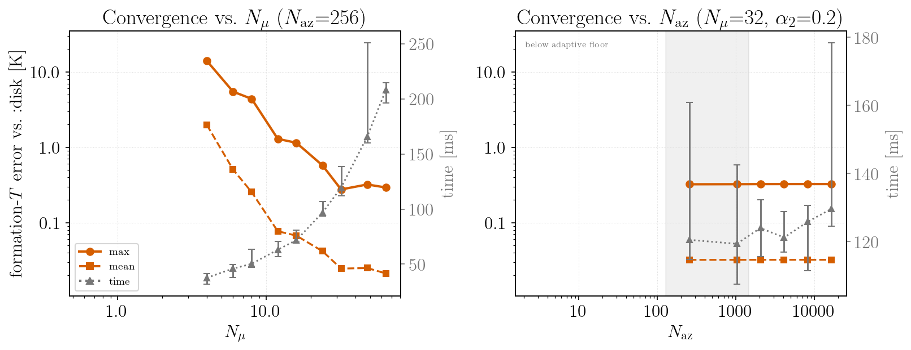
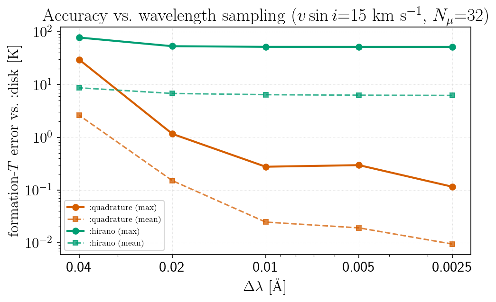

# Integration Methods

```@meta
CurrentModule = FormationTemps
```

`calc_formation_temp` can integrate over the stellar disk in three ways, selected with
the `method` keyword:

| `method` | description | accuracy | speed |
|----------|-------------|----------|-------|
| `:disk` (default) | explicit disk integration over `Nϕ` latitude bins; self-consistent limb darkening | reference | slowest |
| `:quadrature` | Gauss–Legendre μ-quadrature; reproduces the `:disk` physics | within ~2 K of `:disk` | 20–35× faster than `:disk` on CPU; 9–34× on GPU |
| `:hirano` | analytic rotation + macroturbulence convolution (needs `u1`, `u2`) | tens of K at moderate `vsini` | fastest, but only ~1.25× over `:quadrature` on CPU (up to ~2.7× on GPU) |

```julia
calc_formation_temp(star, linelist; method=:disk)                      # reference
calc_formation_temp(star, linelist; method=:quadrature)                # fast, near-reference
calc_formation_temp(star, linelist; method=:hirano, u1=0.43, u2=0.31)  # fastest, approximate
```

All three run on the GPU with `use_gpu=true`.

!!! note "`convolve` is a deprecated alias"
    `convolve=false` maps to `method=:disk` and `convolve=true` to `method=:hirano`.
    New code should use `method`.

## Choosing a method

- **`:disk`** is the default and the reference. Use it for the definitive answer, or for slow
  rotators around `vsini ≈ 1–2` km/s, where `:quadrature` is least accurate (worst-pixel
  ~2 K; mean ≪ 0.1 K). That is where the ring Doppler kernel spans only a few wavelength
  pixels, so quantizing its bin positions to the grid costs the most; it does not improve
  with `Nμ`. The penalty is not monotonic in `vsini` — a non-rotating star has no kernel to
  discretize and agrees to well under 0.1 K, and by `vsini ≳ 5` km/s the kernel is wide
  enough that the error drops back below 1 K.

- **`:quadrature`** is the one to reach for when `:disk` is too slow: it reproduces the
  `:disk` result — including inclination and differential rotation (set via
  [`StellarProps`](@ref)) — to within about 2 K of worst-pixel formation temperature over
  `vsini = 0–40` km/s, while running 20–35× faster on CPU, the margin widening with `Nλ`. On
  GPU the speedup runs from ~9× on the smallest grid tested to ~34× on the largest; it trends
  upward with `Nλ` but not monotonically, since at these sizes both methods are partly launch-
  and transfer-bound rather than purely compute-bound. Use Float64; at
  `gpu_precision=Float32` it is noticeably less accurate. The reformulation itself is exact
  rather than approximate: radiative transfer is wavelength-local, so a Doppler shift of the
  input opacity shifts the emergent intensity identically, and rotation can therefore be
  applied as a per-ring convolution after the transfer solve. That is what lets RT be solved
  once per μ node instead of once per surface tile. What remains is the pixel-grid
  discretization of the ring kernel.

- **`:hirano`** is fastest but assumes a parametric limb-darkening law, so its error
  grows with `vsini` — a physical model difference, not a numerical one. By `vsini ≈ 10` km/s
  it is tens of Kelvin from the reference, where `:quadrature` is still within ~2 K. It also
  disagrees with `:disk` at `vsini = 0`, by a few Kelvin: with no rotation to broaden, the
  limb-darkening parameterization is the only error left, and it does not vanish.



Wall-clock time for each method (CPU and GPU) as a function of the wavelength-grid size, at
the default `Nϕ = 128` and `Nμ = 32`. Points are medians over repeats and the error bars span
them; configurations whose bars overlap are not resolved by the measurement:



The gap between `:quadrature` and `:hirano` is much smaller than the gap between either and
`:disk`: on CPU at the largest grid `:quadrature` costs about 30% more than the analytic
convolution while being an order of magnitude closer to the reference. There is not much left
to buy by giving up the disk-integration physics.

On GPU both are nearly flat in `Nλ` over this range and finish in tens of milliseconds — the μ
loop is short enough that fixed per-call costs dominate. Their relative ordering there is
**unresolved**: at these absolute times the spread over repeats exceeds the difference between
them, so the figure deliberately does not support a claim either way. Only the comparisons
against `:disk`, whose own timings are tight, are well separated from the noise.

Hardware and configuration match the [Parallelization](@ref) benchmarks; regenerate with
`julia --project=. -t auto benchmarks/benchmark_quadrature.jl` followed by
`benchmarks/plot_quadrature.jl`.

Rotation is set by `vsini` (the projected equatorial velocity), `istar`, and the
differential-rotation coefficients `α₂`, `α₄` — see [`StellarProps`](@ref). `:hirano`
supports rigid rotation only.

For rigid rotation `istar` has no physical effect (the projected velocity field carries no
inclination dependence); it matters only once `α₂`/`α₄` are nonzero, because inclination
then selects which latitude bands — rotating at different rates — are visible. See
[`StellarProps`](@ref) for the one numerical caveat at finite `Nϕ`.

## Accuracy notes

- **`Nμ = 32` is the knee; do not raise it.** Cost scales linearly with `Nμ`, and worst-pixel
  agreement with `method=:disk` improves steeply up to the default and then stops: halving to
  16 costs about a factor of four, while doubling to 64 buys nothing measurable. Above the
  knee the residual is no longer set by the μ-quadrature at all — see the next point.
  `test_quadrature.jl` asserts this convergence.

  

  Formation-temperature error against an explicit high-resolution tiling reference, and
  wall-clock cost, for a fast rotator (`vsini = 15` km/s). Both panels share the error axis:
  `Nμ` moves it two decades, `N_az` does not move it at all. Error bars on the cost show the
  spread over timing repeats.

- **Past the knee, spend wavelength resolution rather than nodes.** What limits agreement at
  `Nμ = 32` is the wavelength sampling: the ring Doppler kernel's bin weights are exact but
  their positions are quantized to `Δv = c·Δλ/λ`. Refining `Δλ` therefore keeps improving the
  result after `Nμ` has stopped mattering, and this is the knob to reach for if you need
  better than ~0.3 K agreement.

  

  This is also the cleanest statement of how the two fast methods differ: **`:quadrature`'s
  error converges and `:hirano`'s does not.** Refining the grid drives `:quadrature` down by
  more than two orders of magnitude, while `:hirano` flattens out — its disagreement is a
  model difference that no amount of sampling removes.

  The coarsest point is a warning about grids, not about `:quadrature`. At `Δλ = 0.04` Å a
  solar Fe line spans only a couple of pixels, so the spectrum itself is under-sampled and
  both methods degrade by a comparable amount. Sample the lines properly and this does not
  arise.

- **`N_az` should be left alone.** It is a *lower bound* on the number of azimuthal arcs used
  to build a ring's line-of-sight velocity distribution, and two things keep it from mattering:

  1. It is only read under differential rotation. For solid-body rotation (`α₂ = α₄ = 0`, the
     default) that distribution is the arcsine law, which the ring kernel evaluates
     analytically from its CDF — exactly, and independently of `N_az`.
  2. Even under differential rotation, the arc count is chosen adaptively at roughly 32 arcs
     per velocity pixel of kernel support, and `N_az` only takes effect when it exceeds that.
     So it binds only for rings whose velocity span is narrower than `N_az/32` wavelength
     pixels — slow rotators, where the accuracy limit is the pixel quantization discussed
     above rather than the arc count.

  The `N_az` panel above is measured with `α₂ = 0.2`, so the sampled branch is active, and it
  sweeps past the adaptive count — the shaded region marks where `N_az` is still below it.
  Agreement moves by 0.002 K across a 64× range, including the values that do bind. Read the
  panel as "this knob is inert by design", not as "converged at the default".

- **Formation temperatures in strong saturated cores are lower limits.** Where the flux
  contribution is still peaking at the top of the MARCS grid, `form_temps` is set by where the
  model was truncated rather than by the line's actual formation depth.
  `result.ceiling_ratio` quantifies this per wavelength and
  [`boundary_mask`](@ref) flags the affected wavelengths; a warning reports the count. Exclude
  them before interpreting a formation-temperature spectrum:

  ```julia
  result = calc_formation_temp(star, linelist)
  good = .!boundary_mask(result)          # or boundary_mask(result; r_thresh=…)
  ```

  This covers only the failure that shows up in the contribution function. A line can decay
  well inside the model and still be untrustworthy, because LTE or the atomic data was wrong
  where it formed — see [Lines the model cannot get right](@ref "Lines the model cannot get right").

  Note that Balmer lines are *not* the usual cause. Their lower level (n=2) sits ~10.2 eV
  up, so its population — and hence the line opacity — is negligible in the cool upper
  photosphere and rises steeply with depth. In LTE on a MARCS grid, Hα is a shallow feature
  forming well inside the model rather than at its ceiling; the deep chromospheric core seen
  in the real Sun is outside what a photospheric model can produce.

- **Convolution padding is sized from the kernel support.** The rotational, macroturbulent
  and microturbulent kernels are applied as padded linear convolutions; the padding is
  derived from `vsini`, `ζ` and `ξ` together with `Δλ`, so a fast rotator on a finely
  sampled grid does not silently wrap. If the ring Doppler kernel is wider than the
  synthesis window itself, `:quadrature` warns that the broadening is truncated — widen the
  window with `minλ`/`maxλ`.
