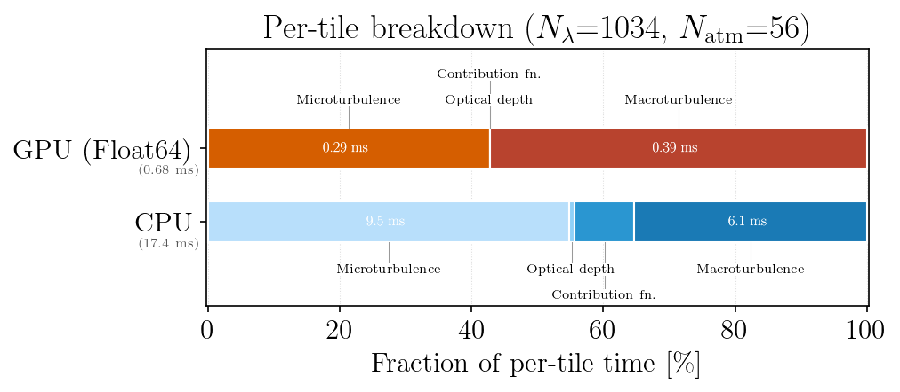
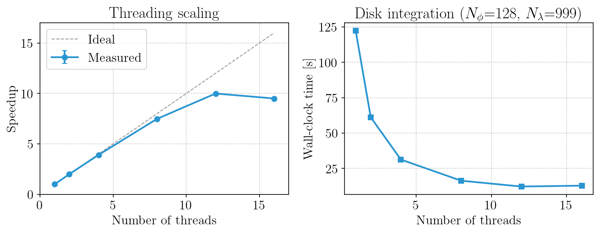
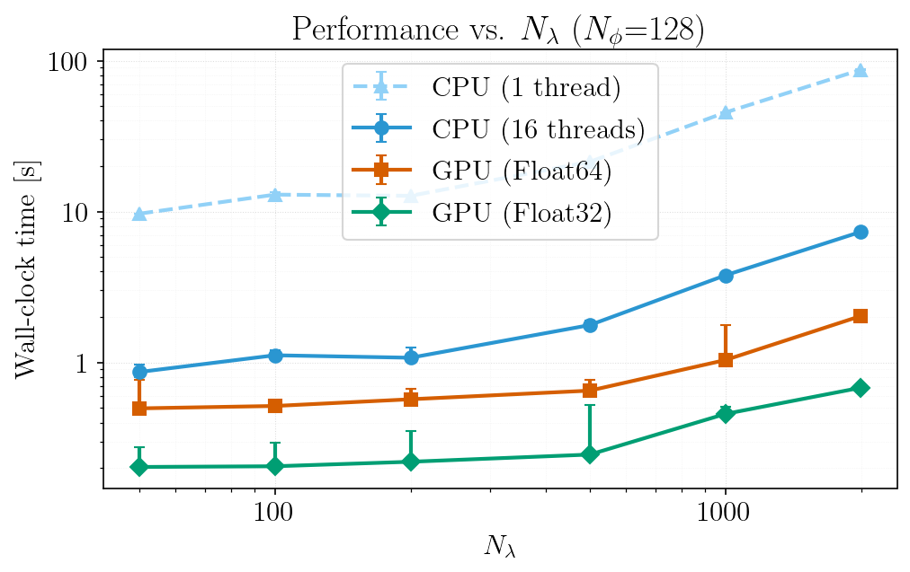
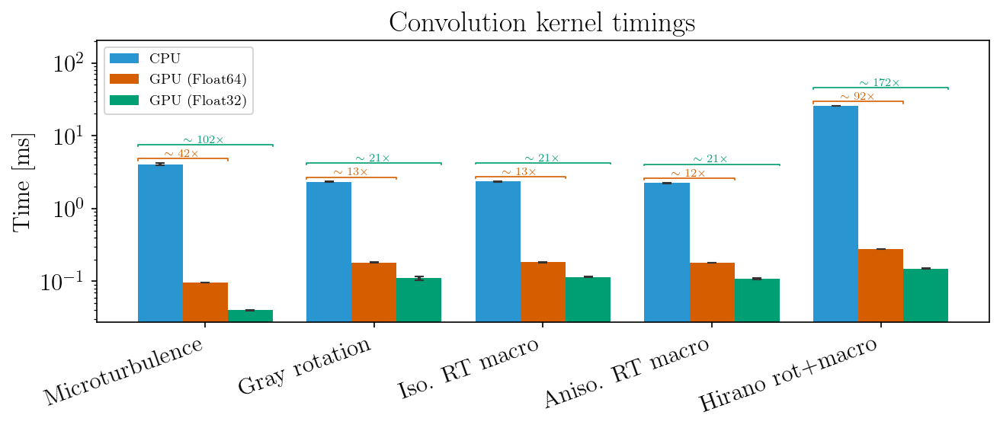
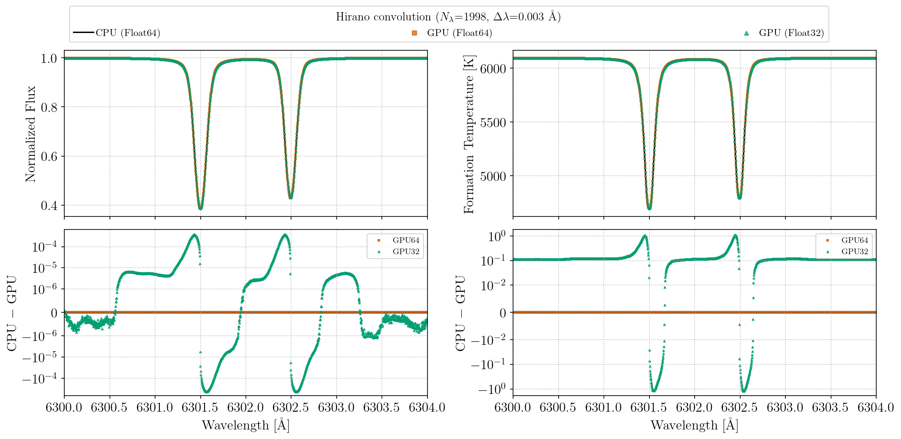
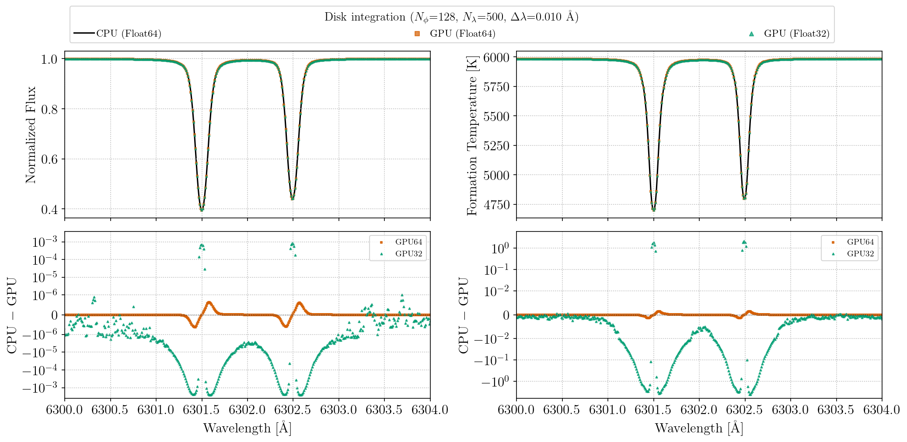

# Parallelization

```@meta
CurrentModule = FormationTemps
```

FormationTemps.jl parallelizes the disk integration pipeline in two complementary ways: **CPU multithreading** across stellar surface tiles, and **GPU acceleration** via [CUDA.jl](https://cuda.juliagpu.org/stable/). Both target the same bottleneck — the per-tile radiative transfer loop that dominates wall-clock time when `convolve=false`.

## CPU Multithreading

### What gets parallelized

When `use_gpu=false` and `convolve=false`, `calc_formation_temp` iterates over every visible tile on the stellar surface (typically thousands for `Nϕ = 128`). Each tile independently computes microturbulent broadening, optical depth, the intensity contribution function, and macroturbulent broadening. These tiles are distributed across Julia threads using `Threads.@threads` with `:static` scheduling.

Each thread receives its own [`CPUTileWorkspace`](@ref) containing pre-allocated working arrays (`τs`, contribution functions, and per-thread accumulators). After the loop, the per-thread accumulators are reduced to produce the final result.

### Setup

Start Julia with multiple threads:

```bash
julia -t auto           # use all available cores
julia -t 8              # use 8 threads
```

Or set the environment variable before launching Julia:

```bash
export JULIA_NUM_THREADS=8
```

You can verify the thread count from within Julia:

```julia
Threads.nthreads()
```

### FFTW considerations

FFTW plan creation is not thread-safe. Before entering the threaded tile loop, `calc_formation_temp` pre-warms the FFTW plan cache on the main thread and sets `FFTW.set_num_threads(1)` to disable FFTW's internal threading (which would compete with tile-level parallelism). The previous FFTW thread count is restored after the loop.

### Limitations

!!! warning "Python interop"
    CPU multithreading is **not compatible** with calling FormationTemps.jl from Python via juliacall/PythonCall. Julia's multi-threaded garbage collector can conflict with PythonCall's runtime bridge, causing hard crashes (SIGBUS/segfault). When calling from Python, `JULIA_NUM_THREADS` must be set to `1`. See the [Python Tutorial](@ref "Python Tutorial") for details.

    If you need both Python interop and parallelism, use the GPU path (`use_gpu=True`) or run the computation in pure Julia and load the results in Python.

## GPU Acceleration

GPU acceleration is enabled by default when a compatible NVIDIA device is detected (`CUDA.functional() == true`); pass `use_gpu=false` to force the CPU path.

### GPU precision

Pass `gpu_precision=Float32` to `calc_formation_temp` to run GPU computations at single precision:

```julia
result = calc_formation_temp(star, linelist; gpu_precision=Float32)
```

Absorption coefficients are always computed at Float64 (a Korg requirement) and converted to the target precision before GPU upload. Float32 roughly halves GPU memory usage and can improve throughput on consumer GPUs with higher FP32 than FP64 performance. The default is `Float64`.

### What gets accelerated

The disk integration pipeline repeats the full radiative transfer calculation for every visible tile on the stellar surface — typically thousands of tiles for `Nϕ = 128`. Each tile requires:

1. **Microturbulent broadening** — FFT-based Gaussian convolution of the absorption coefficient matrix along the wavelength axis, per atmosphere layer.
2. **Optical depth integration** — cumulative integration of absorption coefficients through the atmosphere to build `τ(λ)` at each layer.
3. **Contribution function** — Planck-weighted intensity contribution per layer, combined with `dτ`.
4. **Macroturbulent broadening** — radial-tangential convolution of the contribution function.

On the GPU, tiles are processed in batches of `B` (automatically sized to fit GPU memory). Steps 1--3 use batched CUDA kernels ([`BatchedMicroConvMem`](@ref) for microturbulence, `calc_tau_*_batched!` for optical depth, `calc_intensity_cfunc_dt_batched!` for contribution functions). Step 4 uses a separate FFT-based convolution kernel per tile. Pre-allocated memory structs ([`GPUMemory`](@ref), [`ConvolutionMemory`](@ref), [`BatchedMicroConvMem`](@ref)) eliminate per-tile allocations.

#### Additional GPU optimizations

- **Batched tile processing**: tiles are grouped into batches of `B` (up to 64) and processed simultaneously. The batch size is chosen to stay within 50% of free GPU memory. Dual CUDA streams overlap total and continuum absorption processing.
- **Signal caching**: [`BatchedMicroConvMem`](@ref) caches the forward FFT of the absorption signal (`signal_cached` flag). During disk integration, the absorption coefficients are identical across tiles — only the Doppler shift kernel changes — so the signal FFT is computed once and reused for all batches.
- **Macroturbulence kernel caching**: the radial-tangential kernel depends only on `μ` (the cosine of the viewing angle), not on the tile's rotational velocity. Since many tiles share the same `μ`, kernels are precomputed for each unique `μ` value and looked up during the tile loop.
- **FFT-friendly padding**: convolution buffers are padded to lengths with small prime factors (2, 3, 5, 7) for efficient FFTs via CUFFT.
- **Buffer reuse**: per-tile contribution function results are written into pre-allocated GPU buffers, avoiding repeated `CuArray` allocations during the tile loop.

### Setup

GPU support requires an NVIDIA GPU and a working CUDA toolkit. CUDA.jl handles driver detection and toolkit installation automatically in most cases:

```julia
using CUDA
CUDA.functional()  # should return true
CUDA.versioninfo()  # check device and toolkit details
```

If `CUDA.functional()` returns `false`, consult the [CUDA.jl troubleshooting guide](https://cuda.juliagpu.org/stable/installation/troubleshooting/). FormationTemps.jl will fall back to the CPU path transparently.

### Memory layout

The GPU path pre-allocates all working arrays at the start of a `calc_formation_temp` call:

| Struct | Contents | Lifetime |
|---|---|---|
| [`AtmosphereGPU`](@ref) | Temperature, number density, electron density, optical depth scale as `CuArrays`; typed at `gpu_precision` | One per call |
| [`GPUMemory`](@ref) | `αs`, `τs`, `cfunc`, `cfunc_dt`, and anchored-τ / Bezier work arrays | One per stream (total + continuum) |
| [`ConvolutionMemory`](@ref) | Padded FFT buffers, CUFFT plans, cached signal/kernel transforms | Stationary flux computation |
| [`BatchedMicroConvMem`](@ref) | Shared signal FFT + per-tile batched Doppler filter/convolution buffers | One per stream (total + continuum) during disk integration |

GPU memory usage is determined at allocation time and remains constant throughout the tile loop. All GPU structs are parameterized on the float type from `gpu_precision` (default `Float64`; pass `Float32` to halve memory).

## Benchmarks

The results below were obtained on an Intel Xeon w5-3435X (16 cores / 32 threads) with an NVIDIA RTX 6000 Ada (48 GB). To reproduce, run `julia --project=. benchmarks/run_all.jl` — see the [`benchmarks/`](https://github.com/palumbom/FormationTemps.jl/tree/main/benchmarks) directory for individual scripts.

### Per-tile breakdown

The figure below shows the normalized per-tile timing breakdown for CPU and GPU. On the GPU, the microturbulence, optical depth, and contribution function steps are fused into a single kernel dispatch.



### CPU thread scaling

Speedup and wall-clock time as a function of the number of Julia threads for a full `calc_formation_temp` call with disk integration (`Nϕ = 128`).



### Performance vs. wavelength grid size

End-to-end wall-clock time as a function of `Nλ` (varied by changing `Δλ` over a fixed wavelength window) for single-threaded CPU, multi-threaded CPU, and GPU.



### Convolution kernels

Individual broadening kernel comparisons on a two-line Fe I test spectrum (`Nλ ≈ 400`, `Npad = 2400`).



## CPU vs. GPU numerical differences

The CPU and GPU paths use slightly different algorithms in a few places, leading to small numerical differences. In brief:

- **Microturbulence**: the GPU applies an analytical Fourier-domain Gaussian; the CPU samples a real-space kernel. Flux differences are ~4×10⁻⁴ at typical parameters.
- **RT macroturbulence kernels**: GPU `erfc` vs. CPU `erfc` differ at ~10⁻⁴ relative to peak.
- **Rotation kernels**: the CPU uses unpadded circular FFT; the GPU uses padded linear convolution. This produces edge effects in the first and last few pixels of the spectrum. Interior pixels agree to machine precision.

### Float32 vs. Float64 accuracy

The figures below compare flux and formation temperature spectra ((for two Fe I lines near 6300 Å)) computed at CPU Float64, GPU Float64, and GPU Float32 for a solar-like star. The top row overlays the three spectra; the middle and bottom rows show residuals relative to the CPU Float64 reference.

GPU Float64 residuals are dominated by the algorithmic differences described above (Fourier-domain vs. real-space microturbulence, padded vs. circular convolution). GPU Float32 introduces additional single-precision rounding, primarily visible in the flux residuals at the ~10⁻³ level and in formation temperatures at the ~1–5 K level — well below the systematic uncertainties of 1D model atmospheres.





These plots can be regenerated with `julia --project=. benchmarks/gpu_precision_comparison.jl`.
